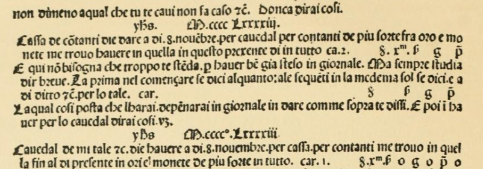

# roman_year
`get_roman_year.py` is a simple command-line tool to convert a year in numbers to a year in Roman numerals.
This is intended to check information about a specific year in the Middle Ages.



(John B. Geijsbeek, Ancient Double-entry Bookkeeping: Lucas Pacioli's Treatise, [Page 48](https://archive.org/details/ancientdoubleent00geijuoft/page/48/mode/2up), [1914])  
(Luca Pacioli, Summa de arithmetica, geometria, proportioni et proportionalita [1494])

## Getting Started
``` powershell or bash
git clone git@github.com:kazsk1/roman_year --recursive
```

## Usage
1. Convert Numbers to Roman numerals in uppercase
``` powershell or bash
python3 get_roman_year.py [NUMBERS]
```

2. Convert Numbers to Roman numerals in uppercase using D
``` powershell or bash
python3 get_roman_year.py [NUMBERS] d
python3 get_roman_year.py [NUMBERS] D
```

3. Convert Numbers to Roman numerals in lowercase using d
``` powershell or bash
python3 get_roman_year.py [NUMBERS] l
python3 get_roman_year.py [NUMBERS] lowercase
```

4. Convert Numbers to Roman numerals in lowercase not using d
``` powershell or bash
python3 get_roman_year.py [NUMBERS] i
```

5. Convert Numbers to Roman numerals in lowercase not using d / using j
``` powershell or bash
python3 get_roman_year.py [NUMBERS] j
```

6. Show Rules of converting Numbers to Roman numerals
``` powershell or bash
python3 get_roman_year.py r
python3 get_roman_year.py rules
```

7. Show Help
``` powershell or bash
python3 get_roman_year.py h
python3 get_roman_year.py help
```

## Examples
1) Convert the year 1493 to the roman year in uppercase
``` powershell or bash
python3 get_roman_year.py 1493
```

  > Conversion
  > 1493 = MCCCCLXXXXIII

2) Convert the year 1888 to the roman year in uppercase using D
``` powershell or bash
python3 get_roman_year.py 1493 d
```

  > Conversion
  > 1493 = MCDXCIII

3) Convert the year 1493 to the roman year in lowercase
``` powershell or bash
python3 get_roman_year.py 1493 l
```

  > Conversion
  > 1493 = Mcdxciii

4) Convert the year 1493 to the roman year in lowercase not using d
``` powershell or bash
python3 get_roman_year.py 1493 i 
```

  > Conversion
  > 1493 = Mcccclxxxxiii

5) Convert the year 1493 to the roman year in lowercase not using d / using j
``` powershell or bash
python3 get_roman_year.py 1493 j
```

  > Conversion
  > 1493 = Mcccclxxxxiij

## License
This project is licensed under the MIT License. See the [LICENSE](LICENSE.txt) file for details.

